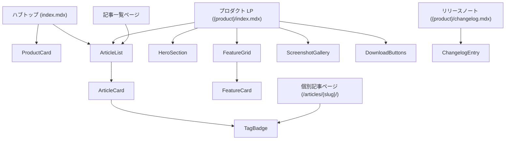

# コンポーネント設計

---

## 1. コンポーネント一覧

| コンポーネント名 | カテゴリ | 説明 |
|----------------|----------|------|
| `ProductCard` | hub | ハブトップのプロダクトカード |
| `HeroSection` | lp | LP ヒーローセクション |
| `FeatureGrid` | lp | 機能紹介グリッドラッパー |
| `FeatureCard` | lp | 機能カード1枚（FeatureGrid 内） |
| `ScreenshotGallery` | lp | スクリーンショットギャラリー |
| `DownloadButtons` | lp | App Store / ダウンロードリンクボタン群 |
| `ArticleCard` | articles | 記事カード1枚 |
| `ArticleList` | articles | 記事一覧（product タグでフィルタリング） |
| `TagBadge` | articles | プロダクトタグバッジ |
| `ChangelogEntry` | changelog | リリースノート1エントリ |

---

## 2. コンポーネント階層図



---

## 3. 主要コンポーネント詳細

### `ProductCard`

- **カテゴリ**: hub
- **用途**: ハブトップページでプロダクトを一覧表示するカード
- **Props**:
  - `name: string` — プロダクト名
  - `description: string` — 一言説明
  - `href: string` — LP への URL
  - `icon?: string` — プロダクトアイコン画像パス
  - `badge?: string` — バッジテキスト（例: "New", "Beta"）
- **表示内容**: アイコン・プロダクト名・説明・「詳しく見る」リンク

---

### `HeroSection`

- **カテゴリ**: lp
- **用途**: プロダクト LP の最上部ヒーローセクション
- **Props**:
  - `title: string` — キャッチコピー
  - `subtitle: string` — サブテキスト
  - `imageSrc?: string` — メインビジュアル画像パス
  - `imageAlt?: string` — 画像の alt テキスト
- **スロット**:
  - `default` — CTA ボタン（DownloadButtons を差し込む）
- **表示内容**: キャッチコピー・サブテキスト・メインビジュアル・CTA

---

### `FeatureGrid`

- **カテゴリ**: lp
- **用途**: 機能カード（FeatureCard）を並べるグリッドラッパー
- **Props**: なし
- **スロット**:
  - `default` — 複数の `FeatureCard` を差し込む

---

### `FeatureCard`

- **カテゴリ**: lp
- **用途**: 1つの機能を紹介するカード
- **Props**:
  - `title: string` — 機能名
  - `description: string` — 機能の説明
  - `icon?: string` — アイコン名または画像パス

---

### `ScreenshotGallery`

- **カテゴリ**: lp
- **用途**: スクリーンショット画像を横並びで表示
- **Props**:
  - `images: Array<{ src: string; alt: string }>` — 画像一覧

---

### `DownloadButtons`

- **カテゴリ**: lp
- **用途**: App Store / Google Play / 直接ダウンロードなどのリンクボタン群
- **Props**:
  - `links: Array<{ label: string; href: string; type: 'appstore' | 'googleplay' | 'direct' }>` — ボタン一覧

---

### `ArticleList`

- **カテゴリ**: articles
- **用途**: 記事をカード一覧で表示。`product` を指定するとフィルタリングされる
- **Props**:
  - `product?: string` — フィルタリングするプロダクト ID（例: `'vision-focus'`）。省略時は全記事
  - `limit?: number` — 表示件数上限（省略時: 全件）
- **挙動**: ビルド時に Content Collections からデータを取得し、`products` フロントマターでフィルタリング

---

### `ArticleCard`

- **カテゴリ**: articles
- **用途**: 記事一覧内の1記事カード
- **Props**:
  - `title: string` — 記事タイトル
  - `description: string` — 記事の説明
  - `href: string` — 記事URL
  - `publishedAt: Date` — 公開日
  - `products: string[]` — タグ付きプロダクト ID 一覧
- **表示内容**: タイトル・説明・公開日・TagBadge 一覧

---

### `TagBadge`

- **カテゴリ**: articles
- **用途**: プロダクトタグを示す小さなバッジ
- **Props**:
  - `product: string` — プロダクト ID（例: `'vision-focus'`）
  - `label: string` — 表示名（例: `'VisionFocus'`）
  - `href?: string` — クリック時の遷移先（省略時はリンクなし）

---

### `ChangelogEntry`

- **カテゴリ**: changelog
- **用途**: リリースノートの1バージョン分のエントリ
- **Props**:
  - `version: string` — バージョン番号（例: `'1.2.0'`）
  - `date: Date` — リリース日
- **スロット**:
  - `default` — 変更内容（Markdown）

---

## 4. MDX での使用例

```mdx
---
title: VisionFocus
---
import { HeroSection } from '@/components/lp/HeroSection.astro';
import { FeatureGrid } from '@/components/lp/FeatureGrid.astro';
import { FeatureCard } from '@/components/lp/FeatureCard.astro';
import { DownloadButtons } from '@/components/lp/DownloadButtons.astro';

<HeroSection
  title="集中力を、もっと自由に。"
  subtitle="VisionFocus は Mac 上の視線を追跡して..."
  imageSrc="/vision-products/assets/vision-focus-hero.png"
  imageAlt="VisionFocus スクリーンショット"
>
  <DownloadButtons links={[
    { label: 'App Store', href: 'https://apps.apple.com/...', type: 'appstore' }
  ]} />
</HeroSection>

<FeatureGrid>
  <FeatureCard
    title="視線追跡集中モード"
    description="画面から目を離したら自動で一時停止"
    icon="eye"
  />
</FeatureGrid>
```
