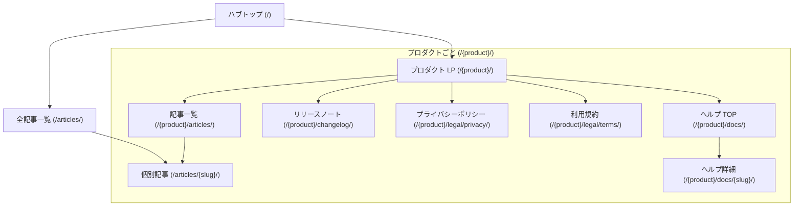

# 画面設計

---

## 1. 画面一覧

| 画面名 | パス | 説明 |
|--------|------|------|
| ハブトップ | `/` | 全プロダクト一覧カード |
| プロダクト LP | `/{product}/` | プロダクト紹介・ダウンロード |
| ヘルプ TOP | `/{product}/docs/` | ドキュメントインデックス |
| ヘルプ詳細 | `/{product}/docs/{slug}/` | 個別ドキュメントページ |
| リリースノート | `/{product}/changelog/` | バージョン更新履歴 |
| プライバシーポリシー | `/{product}/legal/privacy/` | 法的ページ |
| 利用規約 | `/{product}/legal/terms/` | 法的ページ |
| プロダクト別記事一覧 | `/{product}/articles/` | プロダクトタグで絞り込んだ記事一覧 |
| 全記事一覧 | `/articles/` | サイト全体の記事一覧 |
| 個別記事 | `/articles/{slug}/` | 記事本文ページ |

---

## 2. 画面遷移図

---

## 3. 各画面詳細

### ハブトップ（/）

- **要素**
  - サイト全体のヒーー（キャッチコピー + サブテキスト）
  - プロダクトカードグリッド（プロダクト数に応じて自動拡張）
    - プロダクト名・アイコン・一言説明・LP へのリンク
- **挙動**
  - プロダクトカードクリック → プロダクト LP へ遷移
  - 新プロダクット追加時：カードを追加するだけで自動で一覧に反映

---

### プロダクト LP（/{product}/）

- **要素**
  - ヒーローセクション（プロダクト名・キャッチコピー・スクリーンショット・CTA）
  - 機能紹介グリッド（アイコン・機能名・説明）
  - スクリーンショットギャラリー
  - ダウンロード/ストアリンクボタン（App Store, Google Play, 直リンクなど）
  - 関連記事リンク（`/{product}/articles/` へのリンク）
  - ドキュメントリンク・リリースノートリンク
- **挙動**
  - ダウンロードボタン → 外部ストア/ダウンロード URL へ
  - ドキュメント/記事リンク → 各ページへ遷移

---

### ヘルプ TOP（/{product}/docs/）

- **要素**
  - サイドバー：ドキュメント目次（Starlight 自動生成）
  - コンテンツ：ドキュメントインデックス（主要ガイドへのリンク集）
- **挙動**
  - サイドバー項目クリック → 各ドキュメントページへ

---

### ヘルプ詳細（/{product}/docs/{slug}/）

- **要素**
  - サイドバー：ドキュメント目次
  - コンテンツ：本文（見出し・テキスト・画像・コードブロックなど）
  - ページ内目次（Starlight 右パネル自動生成）
  - 前後ページナビゲーション（Starlight 自動生成）
- **挙動**
  - Starlight の標準ドキュメントページ

---

### リリースノート（/{product}/changelog/）

- **要素**
  - バージョン別エントリ一覧（新しい順）
    - バージョン番号・リリース日
    - 変更内容（追加・修正・削除）
- **挙動**
  - 静的ページ、インタラクションなし

---

### プライバシーポリシー・利用規約（/{product}/legal/{privacy|terms}/）

- **要素**
  - 法的文書本文（見出し・テキスト）
  - 最終更新日
- **挙動**
  - 静的ページ
  - URL がプロダクトごとに固定（App Store 申請に使用）

---

### プロダクト別記事一覧（/{product}/articles/）

- **要素**
  - ページタイトル（「{プロダクト名} 関連記事」）
  - 記事カードグリッド（タイトル・説明・公開日・タグバッジ）
  - 全記事一覧へのリンク
- **挙動**
  - 表示する記事は当プロダクトのタグが付いているものに絞り込み済み
  - 記事カードクリック → `/articles/{slug}/` へ

---

### 全記事一覧（/articles/）

- **要素**
  - ページタイトル
  - 記事カードグリッド（全記事）
    - タイトル・説明・公開日・プロダクトタグバッジ
- **挙動**
  - 記事カードクリック → `/articles/{slug}/` へ

---

### 個別記事（/articles/{slug}/）

- **要素**
  - 記事タイトル・公開日
  - プロダクトタグバッジ（クリックで `/{product}/articles/` へ）
  - 本文（Markdown/MDX）
  - 関連プロダクトリンク
- **挙動**
  - タグバッジクリック → プロダクト別記事一覧へ
  - Starlight の標準ページレイアウトを使用（サイドバーなし or 最小限）
